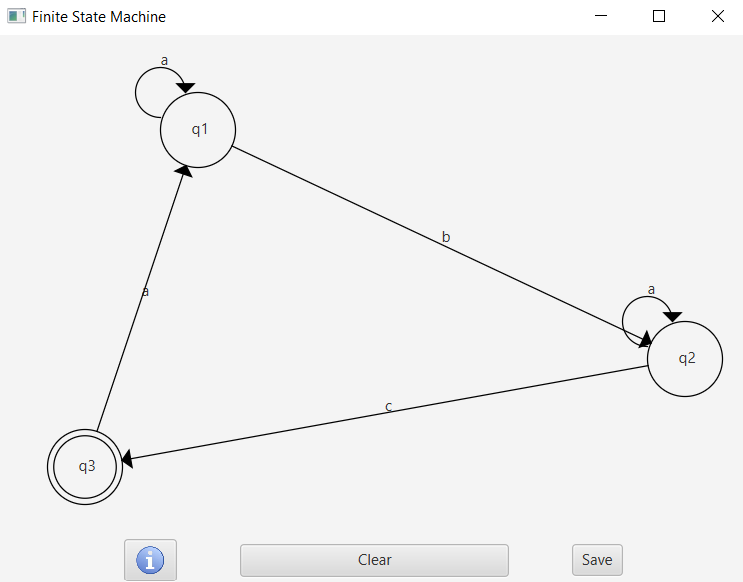

# Finite State Machine
This project lets you create your very own finite state machine, using Java and 
JavaFX, while implementing OOP principals.

How to install:
Make sure you have Java installed, as well as JavaFX. 
You can install JavaFX via this link:
   https://openjfx.io/openjfx-docs/#install-javafx
   
How To Use:
1. Double-click on the Scene to add a new State.
2. Press on a State or Pass to select it.
3. To create a Pass, select a State, hold SHIFT and select the target State.
4. Right-click on a State or Pass to rename it.
5. Delete a selected State or Pass by pressing BACKSPACE

